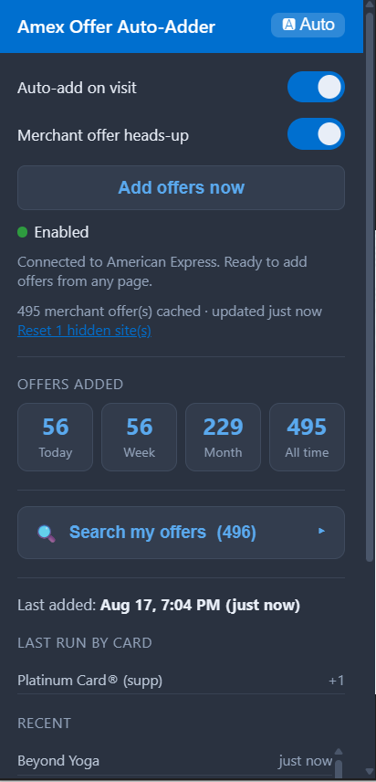
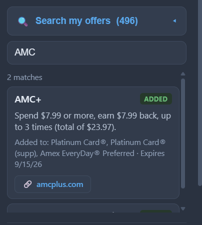
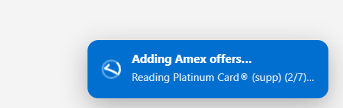

<h1 align="center">Amex Offer Auto-Adder</h1>

  A Chrome extension that instantly enrolls you in <b>every eligible Amex Offer
  across all your cards</b> — no scrolling, no clicking through tiles.

  
  
  
  

---

Amex Offers make you add each deal to your card one tile at a time — dozens of
them, on every card. This extension does it all in one click by talking to
Amex's own offers API with your existing logged-in session. It works from **any**
Amex page (the dashboard is fine), covers **every card** on your account
including authorized-user cards, and only counts offers that were **actually
new** to each card.

## Screenshots

<table>
  <tr>
    <td align="center" width="50%">
       
      <b>Dashboard</b> — controls, totals, and recent activity at a glance
    </td>
    <td align="center" width="50%">
       
      <b>Offer search</b> — find deals across every enrolled card
    </td>
  </tr>
</table>

   
  <b>Live progress</b> — follow each card as offers are added

## Features

- **One click, every card** — reads all your cards and enrolls every eligible
  merchant offer, including supplementary/authorized-user cards.
- **Works anywhere on Amex** — no need to open the Offers page or scroll.
- **Fast** — direct API calls, not DOM automation. Hundreds of offers in
  seconds, with randomized pacing to stay gentle.
- **Honest counts** — de-dupes against offers already on each card, so "added"
  means genuinely new enrollments.
- **Live progress** — an on-page toast and an animated toolbar status wheel show
  what's happening in real time.
- **Stats & history** — today / week / month / all-time counters, a per-card
  breakdown of the last run, and a log of recently added offers.
- **Merchant heads-up** — after a run caches your offers, visiting a merchant's
  website (e.g. `glassesusa.com`) pops a small "Amex Offer available here" card
  with the deal, the card it's on, and an **Add to card now** button if you
  haven't enrolled yet.
- **Safe by default** — stops immediately on any rate-limit or logged-out
  response instead of hammering the API.

## Install

> Loaded unpacked — not on any extension store. Chrome and Firefox both
> supported. Grab the matching zip from the [latest release](../../releases/latest).

### Chrome / Edge / Brave

1. Download `amex-offer-auto-adder-vX.Y.Z.zip` from the latest release and unzip it.
2. Open `chrome://extensions`.
3. Turn on **Developer mode** (top-right).
4. Click **Load unpacked** and select the unzipped folder (the one with `manifest.json`).
5. Pin the extension.

### Firefox

1. Download `amex-offer-auto-adder-firefox-vX.Y.Z.zip` from the latest release and unzip it.
2. Open `about:debugging#/runtime/this-firefox`.
3. Click **Load Temporary Add-on…** and select the `manifest.json` inside the unzipped folder.
4. (Temporary loads clear when Firefox closes; for a permanent install the add-on must be signed via AMO.)

The Firefox build lives in the [`firefox/`](firefox) folder of this repo.

## Usage

1. Log in to Amex (any page — the dashboard works).
2. Click the extension icon.
3. Click **Add offers now** for a one-off run, or flip **Auto-add on visit** on
   to run automatically whenever you open an Amex page.
4. Watch the toolbar status wheel and the on-page toast track progress. Open the
   popup any time for stats and a per-card breakdown.

## How it works

Your Amex data and offer processing run entirely client-side using your own
session cookies (`credentials: "include"`) — no passwords, no tokens, and your
account/offer data never leaves your browser.

The only network call the extension makes to its own server is a single
**anonymous install ping** (see [Privacy](#privacy)).

1. `GET /api/servicing/v1/member` → every card's `account_token`.
2. Per card, `POST ReadOffersHubPresentation.web.v1`
   (`requestType: OFFERSHUB_LANDING`), walking pages until they run out, keeping
   `offerType === "MERCHANT"` offers.
3. Fetch already-added offers (`ADDEDTOCARD_LANDING`) and filter them out.
4. For each remaining offer, `POST CreateOffersHubEnrollment.web.v1` with that
   card's own `offerId`. Success = `status.purpose === "SUCCESS"`.

Pacing is randomized (~0.25–0.7 s between offers); transient `5xx`/network
errors retry a couple of times, and any `429/403/401` or non-JSON response stops
the run immediately.

## Configuration

Tweak the `CFG` object at the top of [`content.js`](content.js):

| Option                  | What it does                                   |
| ----------------------- | ---------------------------------------------- |
| `minDelay` / `maxDelay` | Delay range between offers (ms). Raise if throttled. |
| `maxPages`              | Offer pages to walk per card.                  |
| `maxRetries`            | Retries on transient (5xx/network) errors.     |
| `maxEnroll`             | Safety cap on enrollments per run.             |

## Troubleshooting

Amex changes their internal endpoints from time to time. If nothing gets added:

1. Open DevTools (F12) → **Console** on an Amex tab and look for `[AmexAutoAdd]`
   logs — they show card counts, per-card offer counts, and any "blocked" state.
2. In the **Network** tab, load the Offers page and compare the real requests to
   `ReadOffersHubPresentation.web.v1` / `CreateOffersHubEnrollment.web.v1`
   against the constants in `content.js`; update if they've changed.
3. Reload the extension on `chrome://extensions`.

## Project layout

| File            | Purpose                                                |
| --------------- | ------------------------------------------------------ |
| `manifest.json` | MV3 manifest, permissions, icons                       |
| `content.js`    | Reads cards & offers, enrolls, logs stats              |
| `background.js` | Toolbar icon, animated status wheel, badge             |
| `popup.html/js` | Popup UI: toggle, run button, stats & history          |
| `icons/`        | Toolbar / extension icons                              |

## Privacy

- Your **Amex account and offer data never leave your browser** — all API calls
  go directly to americanexpress.com from your session.
- On **first install only**, the extension sends one anonymous ping to
  `buza.dev` so the author can count installs. It contains a **random ID**
  (generated locally, not linked to you), the extension version, and your
  browser name. No personal data, no account data, no browsing history.
- Nothing is sent on updates, runs, or when browsing merchant sites.

## Disclaimer

For personal use on your own account. It automates undocumented American Express
endpoints, which is against Amex's Terms of Service — use at your own risk. The
extension is not affiliated with or endorsed by American Express.

Author: **Tyler Buza** · [buza.dev](https://buza.dev)

## License

[MIT](LICENSE)
